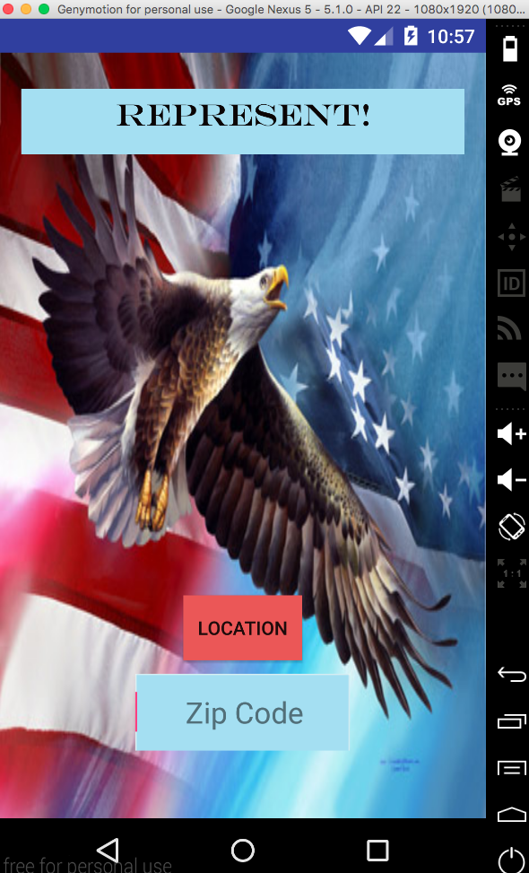
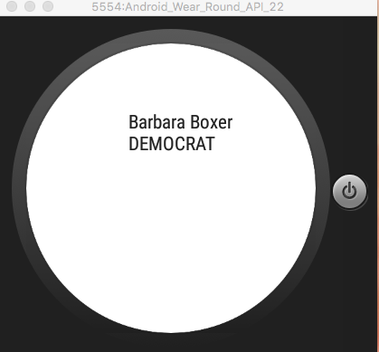
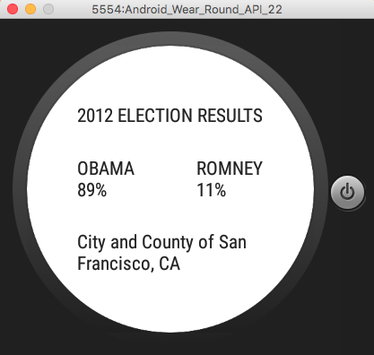
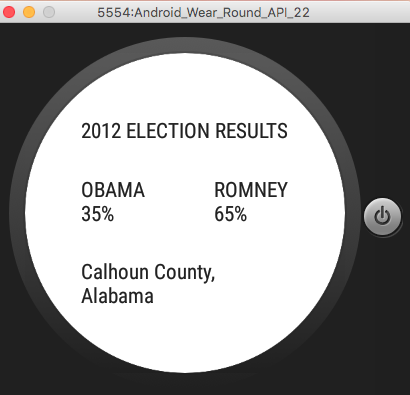

# PROG 02: Represent!

The Represent App utilizes both Android mobile and wear in order to create a function and integrated phone/watch application. The application takes in a zipcode or location and loads a congressional view of representatives in the area on the phone and a slidable view on the watch. When a user clicks on a representative on the watch, the detailed view of that representative pops up on the phone, while the election results in that area are shown on the watch. If the user clicks on the representative on the phhone in congressional view, it also pops up a detailed view on the phone. A user can also choose to randomize the location and show the election results for given random county by shaking the watch. 

## Authors

Keshav Thvar ([kthvar@berkeley.edu](mailto:kthvar@berkeley.edu))

## Demo Video

See [Represent!] (https://vimeo.com/157887983)

## Screenshots

## Acknowledgments

Used StackOverflow immensely as well as http://jasonmcreynolds.com/?p=388 to implement the shuffle/shake view.

